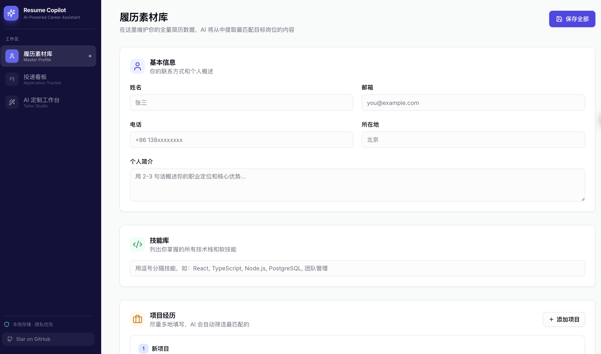
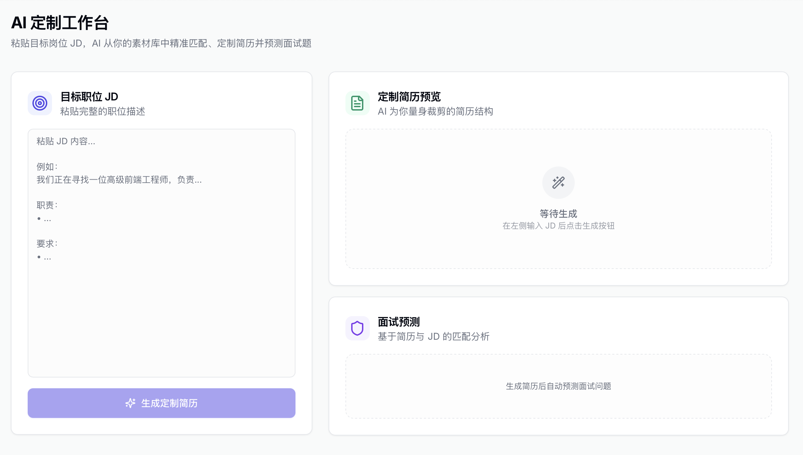

<div align="center">
  
  <video src="./public/demo-video.mp4" width="100%" controls autoplay muted loop></video>
  
  <h1>✨ Resume Copilot</h1>
  <p><strong>你的私人 AI 求职助理：粘贴 JD，一键生成满分简历与面试题</strong></p>
  <p>🔥 告别海投，让每一份简历都像经过专业猎头打磨 🔥</p>

  <p>
    <a href="#-为什么需要-resume-copilot">核心亮点</a> •
    <a href="#-产品展示">产品展示</a> •
    <a href="#-傻瓜式安装教程小白必看">安装教程</a> •
    <a href="#-常见问题">常见问题</a>
  </p>

</div>

---

## 💡 为什么需要 Resume Copilot？

每次看到心仪的岗位，你是不是都在重复这些令人头疼的劳动？
- 😫 在长篇大论的“全量简历”里，手动删减、挑选经历。
- 😫 照着对方的 JD（职位描述），绞尽脑汁修改措辞和项目亮点。
- 😫 面试前疯狂在网上搜面经，却不知道面试官针对**你的简历**会问什么。
- 😫 用 Excel 艰难地记录“投了哪家”、“进展到哪步了”。

**有了 Resume Copilot，这些工作只需 5 秒钟，点击一次按钮即可完成。**

### 🌟 我们的核心优势：
1. **反幻觉红线**：AI 绝对**不会**无中生有捏造经历。它只会用高情商的话术（STAR法则）重新包装你的真实经历。
2. **精准狙击**：无论你做过多少项目，它只为你挑选最能击中该岗位核心诉求的 3 个项目。
3. **“薄弱点”面试预测**：除了高频常规题，它还会敏锐地找出你简历中不满足 JD 的“薄弱点”，并生成压力测试题，让你提前准备，有备无患。
4. **绝对的数据隐私**：所有数据全部存储在**你的个人电脑上**，绝不上传任何云端服务器！

---

## 📸 产品展示

### 1. 🎯 核心功能：AI 定制工作台
左侧粘贴目标岗位的 JD，右侧自动生成定制的自我介绍、匹配的技能标签、重新包装的项目经历，以及预测的面试题。
<div align="center">
  
</div>
<br/>

### 2. 📋 你的“弹药库”：履历素材库
在这里尽情填写你从小到大的所有经历、掌握的所有技能。不用担心太长，AI 会在定制时帮你做减法。
<div align="center">
  
</div>
<br/>

### 3. 📊 直观掌握进度：投递看板
拖拽式管理你的每一次投递机会，从“准备中”到“已结束”，不再错过任何一个 Offer。
<div align="center">
  
</div>

---

## 🚀 傻瓜式安装教程（小白必看）

虽然这是一个开源的程序，但你**不需要懂任何编程知识**也能在自己的电脑上运行它。请跟着下面的步骤一步步来，只需要 3 分钟！

### 前置准备：你需要两个东西
1. **一个 AI 密钥 (API Key)**：这是让软件拥有“大脑”的钥匙。你可以去 [OpenAI官网](https://platform.openai.com/) 或 [Anthropic官网](https://console.anthropic.com/) 注册并获取一个（长得像 `sk-xxxx...` 的一串字母）。
2. **下载 Node.js**：这是一个运行环境。去 [Node.js 官网](https://nodejs.org/zh-cn) 下载并安装“长期维护版 (LTS)”。一路点击“下一步”安装即可。

### 开始安装：

**第 1 步：下载项目**
点击这个页面右上角的绿色按钮 `<> Code`，选择 **Download ZIP**，下载后解压到你的电脑里。

**第 2 步：配置你的 AI 密钥**
打开刚才解压的文件夹，找到里面一个名叫 `.env.example` 的文件。
1. 把这个文件的名字重命名为 `.env.local`。
2. 用记事本（或任何文本编辑器）打开它。
3. 把你准备好的 API Key 填进去，保存并关闭。就像这样：
```text
AI_PROVIDER=openai
OPENAI_API_KEY=sk-在这里粘贴你的真实密钥
OPENAI_MODEL=gpt-4o
```

**第 3 步：启动软件**
如果你用的是 Windows 系统：
1. 打开解压的文件夹。
2. 在文件夹顶部的地址栏（显示路径的地方）输入 `cmd`，然后按回车。会弹出一个黑色的命令窗口。

如果你用的是 Mac 系统：
1. 找到“终端 (Terminal)”应用并打开。
2. 输入 `cd `（注意有个空格），然后把解压的文件夹拖进终端窗口，按回车。

**最后，在刚才打开的窗口里，依次输入并回车运行这三行魔法指令**（每一行运行完可能需要等一小会儿）：

```bash
# 第一步：安装必要的组件
npm install

# 第二步：初始化你本地的安全数据库
npx prisma db push

# 第三步：启动软件！
npm run dev
```

看到绿色的 `Ready` 字样后，打开你的浏览器，输入网址：**http://localhost:3000**

🎉 **恭喜你！你的私人 AI 求职助理已经上线！** 🎉

---

## 🙋 常见问题

**Q: 使用这个软件需要付费吗？**
软件本身完全免费且开源。你只需要向提供 AI 模型接口的服务商（如 OpenAI）支付极低的使用费（按你生成的字数扣费，修改一份简历通常不到一毛钱）。

**Q: 我的简历数据安全吗？会不会被用来训练 AI？**
绝对安全。本软件没有自己的服务器，你的所有经历数据都保存在你电脑本地。在生成简历时，你的数据会直接通过官方加密通道发送给你配置的 API 提供商。

**Q: 既然生成这么方便，我可以把生成的简历直接下载成 PDF 吗？**
由于目前是 1.0 版本，PDF 导出功能还在紧张开发中！目前的最佳用法是：把生成的极佳文案，复制到你常用的简历排版工具（如超级简历、木即简历）中。

---

<div align="center">
  <p>如果 Resume Copilot 帮你拿到了心仪的 Offer，请务必回到这里给项目点一个 <b>⭐ Star</b>！</p>
  <p>你的支持是我们持续优化的最大动力。</p>
  <p>Built with ❤️ for Job Seekers</p>
</div>
